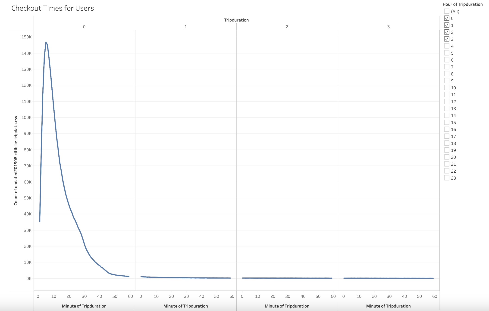
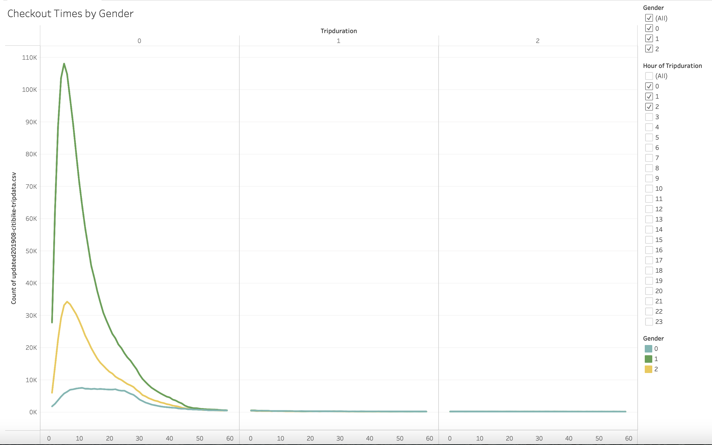
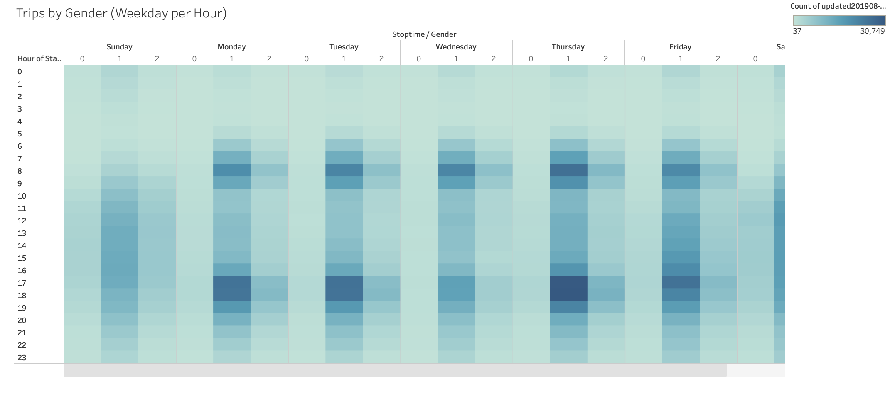
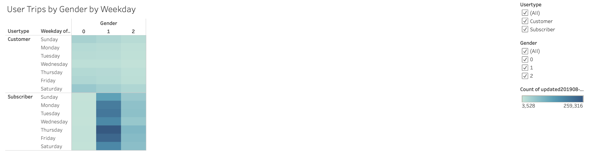

# Bikesharing Analysis

# Overview
The purpose of this analysis was to determine details that make a bikesharing business more successful - specifically looking at NYC citibike data to determine if setting it up in a new city would make any sense. The trends are outlined in this tableu public report: https://public.tableau.com/app/profile/natalia.k3958/viz/ChallengeModule14Finished

# Results

This particular chart make it apparent that most bike users were using bikes for short rides - mostly under 20 minutes long. This means that more urban cities will have higher success with bikesharing programs, as people don't want to travel far, but would prefer quick rides.

As far as gender data, males were more likely to use the bikes than females. This is most likely a personal preference, but targeting men for this new business that is being explored may be a strategy to attract customers.

Just like the previous chart, this again points to more men using bikes than women. However, this also shows that men are more likely to use these bikes to commute to work, as the darker rectangles indicate a higher number of bike users at those times. They correlate with 8 am and 5 pm from Monday - Friday.

This, again, shows that most of these bikes are used to commute to work during the weekdays. However, I think this may also be an interesting point of data to see that there is potential in the weekends. People still use the bikes, but at different times, and most likely for leisurely activities. Maybe some sort of ideas to get people on bikes during the weekends will boost usage, since it falls compared to weekdays.

Again, this is just another visualization that continues the story that men are most likely to use these bikes all week round. This can be a great opportunity to attract female riders.

# Summary
I think that this analysis is very useful in order to determine the types of cities something like this may work in. Urban cities would work best, with a more active population of people in general. Some more analysis I think may be useful would be to include activity scale of gender statistics in cities with more bike ride data to see if there's any correlation there. Maybe in other cities women bike more because they're more active, and in NYC the men just tend to be more active? Another one would be socioeconomic status. Specifically how much money people are making who are using this service. Clearly people have some money, but if it was a lot of it, I doubt that a bike situation would be used at all. 
